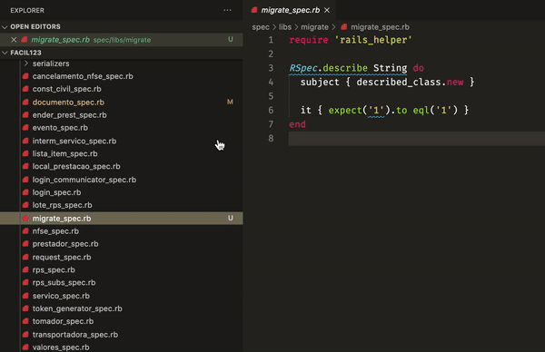

# rspec-quick-spec README

## Features

This extension only creates an `_spec.rb` file on relative path to the spec dir.

If you open a file in `./app/models/user.rb` and activate the extensions, the extension verify if already exists a file on `./spec/models/user_spec.rb`, if does not, it creates the file with a little sample and opens the file.

## Extension Settings

* `rspec-quick-spec.createSpec`: To activate the extension.

## Known Issues

None

## Release Notes

Users appreciate release notes as you update your extension.

### 1.0.0

Initial release of **Rspec quick spec**

**Enjoy!**
